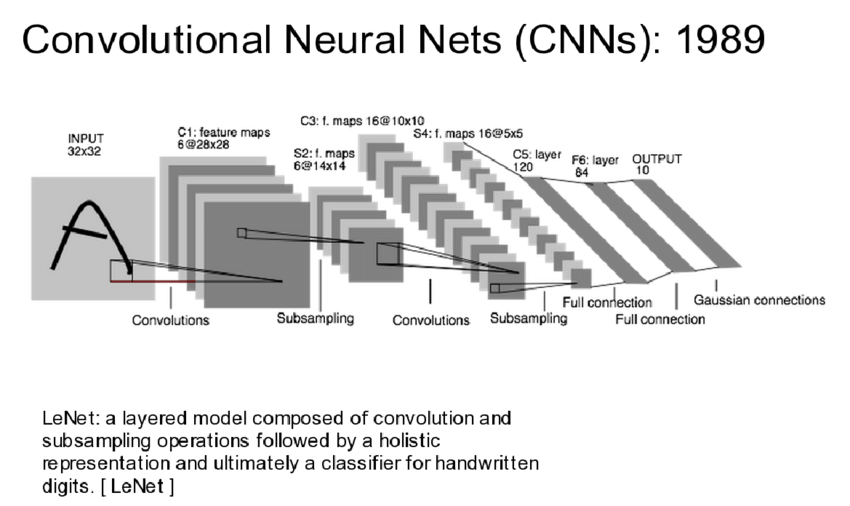
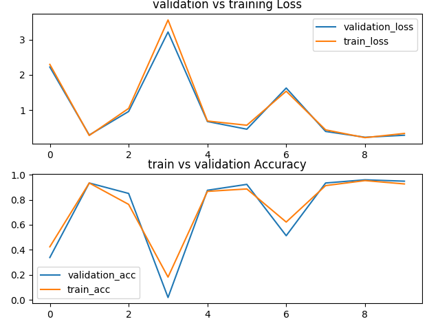
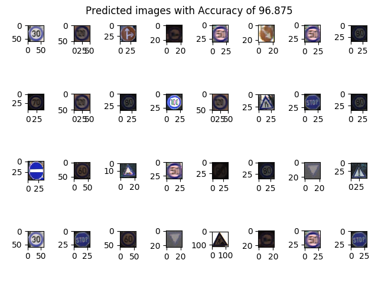

<h2> Traffic Sign Classification. </h2>

In this work I make a small model for classification of different signs on road for example stop sign, walking sign, no entry sign etc.
This work is not based on any paper instead inspired by udacity nano degree program for self driving car. The blog post for this is available in Medium artical of udacity self driving car, you can check that out. 

<h2> Dataset. </h2>
Link for dataset: German traffic sign benchmarking https://benchmark.ini.rub.de/gtsrb_dataset.html
<h2> Project Overview. </h2>

In this work I used LeNet architecture by <b>Yann LeCun </b> proposed in 1989, This architecutre consist of convolutional layer followed by <b> sigmoid </b> activation but in my case I used <b> tanh </b> after the activation layer it consist of  Subsampling layer which is nothing but average pooling followed by Linear layers.
This is very compact and easy to implement architecture, which perform really well for this project.

 

<h2> Installion. </h2>
  <ul>
  <li> Python==3.6.6</li>
  <li> Pytorch==1.6.0</li>
  </ul>
<h2> Preprocessing. </h2>

If you go through <b> dataset.py </b> it contain two function for visualizing  distribution of classes and distribution of images, You can play with different normalization vs standardization techniques, In this project I use standardization approach, where i transform my image to have mean 0 and standard deviation of 1. Their is no standard way to choose which technqiues we should use, Mostly depend on the distribution of data. 
Second thing, in given dataset we are provided with bounding boxes so instead of sending the whole image to Model, I cropped the image using those bounding box convert it to gray scale and apply <b> low pass filter </b> (GaussianBlur), to remove noise and smooth the images. 
Than I resize my image to 32 by 32 with channel of 1. Next thing which is really imortant if you visualize the classes from the function given in dataset.py you will realize that data is highly imabalanced, So it can easily become bias for certain classes which is not good.
So I used few techniques to deal with this situation thanks to pytorch. 
<ul>
  <li> Number one, I seprate train, test and validation data using GroupShuffleSplit followed by SubsetRandomSampler </li>
  <li> Second, I compute the weight for frequency of Labels, whose formula is given as <b>(1./frequency_of_labels)</b> and used WeightedRandomSampler with replacement False so that we don't have repeated values, this help to balanced a data. </li>
</ul>
Above approaches may not necessary work for every case of imabalanced dataset.

<h2> Training & Testing. </h2>

<pre>
For Training:
<code>
  python model.py --train yes
</code>
For Testing:
<code>
  python model.py --train no
</code>
</pre>

<h2> Results. </h2>

I train this network for only 10 epochs, with limited dataset Feel free to use more dataset and change the network according to your need. Image below shows loss and accuracy of trian and validation sets. 
<figure>

<figure>
  

 Image below shows the prediction output of test images 
    <figure>
    
  </figure>

  <h2> Important Note. </h2>
  This kind of classifier is a major componet of self driving car, for example if we use detection algorithm to detect the signs on road we than can use these classifier to predict which kind of signs are those. So this project can be combined with some object detection algorithm where the task of detection algorithm should be to detect signs on road. Project can be extended for classification of traffic lights.
  
  <h2> Contribute. </h2>
  Feel free to contribute and point out any mistake in code, I am still exploring this facinating field of AI. Hope to Improve more in near future.
